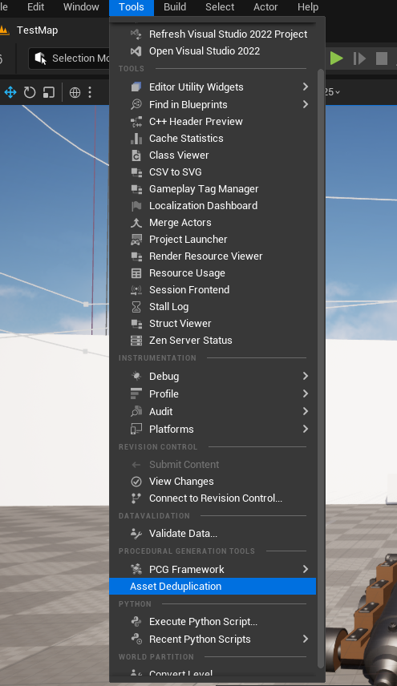
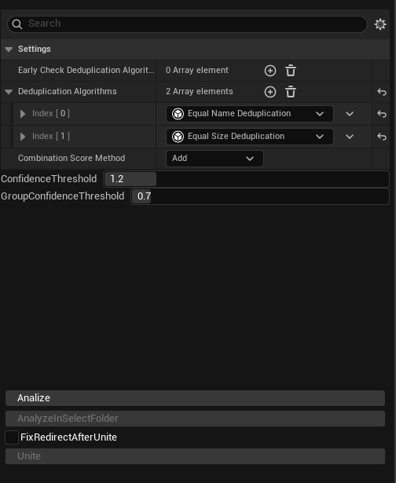
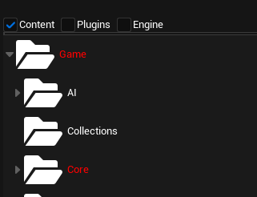

  <picture>
    <source media="(prefers-color-scheme: dark)" srcset="./media/logo-dark.png">
    
</picture>

---

<h1 align="center">
Plugin for Removing Duplicates in Unreal Engine Project
</h1>

<h2 align="center">
    ⚠️ Disclaimer ⚠️
</h2>

  The author is not responsible for any possible consequences resulting from the use of this project.
  By using the materials in this repository, you automatically agree to the terms of the associated license agreement.

  
⚠️ Full Text ⚠️

1. By using the materials in this repository, you automatically agree to the terms of the associated license agreement.

2. The author provides no warranties, express or implied, regarding the accuracy, completeness, or suitability of this material for any specific purpose.
3. The author shall not be liable for any losses, including but not limited to direct, indirect, incidental, consequential, or special damages, arising from the use or inability to use this material or its accompanying documentation, even if the possibility of such damages was previously communicated.

4. By using this material, you acknowledge and assume all risks associated with its application. Furthermore, you agree that the author cannot be held liable for any issues or consequences arising from its use.

* * * * * * * * * * * * * * * * * *
* * * * * * * * * * * * * * * * * *

<h1 align="center">📊 Installation</h1>

<h3 align="left">1. Install the plugin by placing it in the <code>Plugins</code> folder of your Unreal Engine project.</h3>

<h3 align="left">2. Open the plugin main utility window.</h3>

  

* * * * * * * * * * * * * * * * * *
* * * * * * * * * * * * * * * * * *

<h1 align="center">🚀 Quick Start</h1>

<h3 align="left">1. Configure your deduplication algorithm in the window on the right.</h3>

You configure the algorithm from different <code>DeduplicateObject</code>. <code>DeduplicateObject</code> look for groups of similar objects. These groups are combined into clusters through the sum or multiplication through the 
<code>Combination Score Method</code>, and then filtered by the <code>Confidence Score</code> and <code>Group Confidence Score</code>.

  
  

<h3 align="left">1. Analyze</h3>

  To begin, configure the Deduplicator Object above, then select Analyze from the control panel or select the folder in which you want to analyze the value and click Analyze in Folder.

Wait antill analize operation complete.

<h3 align="left">2. Merge</h3>

Once complete, all potential duplicate objects will appear in the "Content" section on the right. You can view merge parameters and test results in the statistics window by selecting a specific asset or folder, and configure filters. Select priority folders or resources that are the primary entities for deduplication, and then click <code>Unite</code>.
<>

  

<h3 align="left">3. Profit. For more specific information, read documentation</h3>

* * * * * * * * * * * * * * * * * *
* * * * * * * * * * * * * * * * * *

<h2 align="center">
> 💡 Additional Information:
</h2>

For more information, read the attached documentation.

* * * * * * * * * * * * * * * * * *
* * * * * * * * * * * * * * * * * *

<h1 align="center"> 📜 License</h1>

<h2 align="center">
  <strong>-------></strong>
  <strong> This project is distributed under the </strong>
  <a href="./LICENSE">License</a>
  <strong><-------</strong>
</h2>

---

<h1 align="center">📬 Feedback</h1>

If you encounter any issues or have suggestions — create an
<a href="https://github.com/issues">Issue</a>
or
<a href="https://github.com/pulls">Pull Request</a>

---

<h2 align="center">
📚 Documentation and Showcase
</h2>

<h3 align="center">Showcase Video</h3>

  <a href="https://youtu.be/aj4SMnDF4fk?si=Y8tI0uOJMNXPnQGJ">Watch on YouTube</a>

<h3 align="center">Documentation</h3>

  <a href="https://docs.google.com/document/d/1CfPzAvMcwM8HJiePUiIiFC_vtNq1W1RfXnq0VOJqHMg/edit?usp=sharing">Read Full Documentation</a>

